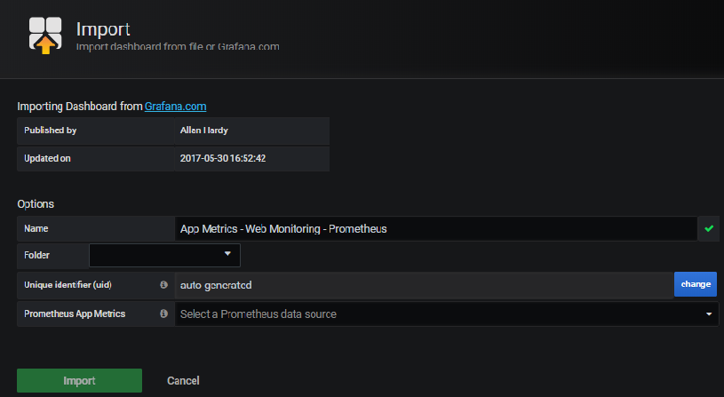

## Monitoring using App Metrics, Prometheus & Grafana

This document outlines how to instrument Contoso Expenses application and monitor using Prometheus & Grafana.

 - Local development & testing 
 - Deployment & configuration of AKS cluster

### Development

First step is to instrument the application using [App Metrics](https://github.com/AppMetrics/AppMetrics). 

- Add following App Metrics NuGet packages. I've used latest preview version.
```
    1. App.Metrics.AspNetCore 
    2. App.Metrics.AspNetCore.Endpoints
    3. App.Metrics.AspNetCore.Tracking
    4. App.Metrics.Formatters.Prometheus
    5. App.Metrics.AspNetCore.Mvc
```
   + 

- In Startup.cs class, ConfigureServices method add the following on the top. This will register IMetrics interface in our application. 

```csharp
       services.Configure<KestrelServerOptions>(options => { options.AllowSynchronousIO = true; });
		            services.AddMetrics();
```
- In Program.cs class, CreateHostBuilder method add the follolwing.Comment the existing CreateWebHostBuilder and add the following:

```csharp
			    public static IHostBuilder CreateHostBuilder(string[] args) =>
			           Host.CreateDefaultBuilder(args)
			               .UseMetricsWebTracking()
			               .UseMetrics(options =>
			               {
			                   options.EndpointOptions = endpointsOptions =>
			                   {
			                       endpointsOptions.MetricsTextEndpointOutputFormatter = new MetricsPrometheusTextOutputFormatter();
			                       endpointsOptions.MetricsEndpointOutputFormatter = new MetricsPrometheusProtobufOutputFormatter();
			                       endpointsOptions.EnvironmentInfoEndpointEnabled = false;
			                   };
			               })
			               .ConfigureWebHostDefaults(webBuilder =>
			               {
			                   webBuilder.UseStartup<Startup>();
			               });

```
- That’s all, now you can run the application and check out the out of the box metrics using /metrics-text endpoint for application level metrics.
  + For example: https://localhost:44335/metrics-text 

- Now you can let Prometheus scrape App Metric's metrics endpoint (example: https://localhost:44335/metrics-text ) and collect the metrics and store it in Prometheus timeseries database. From there you can leverage Grafana to point to Prometheus database to import the data to its own store to show nice dashboards.

- Let's run **Prometheus** locally (you can also run as a docker container)
  + Download stable (not pre-release)  latest Prometheus (example: prometheus-2.17.2.windows-amd64.tar.gz) from https://prometheus.io/download/
  + Extract the zip
  + Run the Prometheus exe (for example: "C:\Users\umarm\Downloads\prometheus-2.17.1.windows-amd64\promtool.exe") 
  + Before you run the exe, modify the prometheus.yaml to scrape right endpoints under Scrape_configs: section
  ```yml
  - job_name: 'contosoweb'
	static_configs:
	  - targets: ['localhost:44335']
	metrics_path: /metrics-text
  ```
  + 

- Run Prometheus.exe and it will be ready to scrape metrics. 

- Run Contoso Web application locally in debug mode, give it about 15 seconds, Prometheus will start scraping metrics endpoint. 

- Now browse to, http://localhost:9090 and search for any metrics for example: application_httprequests_active and you will see 1 in the value. 
 + 

- Let's run **Grafana** locally
  + Download Windows installation: https://grafana.com/grafana/download?platform=windows
  + You can either install locally on your pc or download the Zip, extract and run only when needed (recommended).
  + Run the Grafana exe for example: "C:\Users\umarm\Downloads\grafana-6.7.2.windows-amd64\grafana-6.7.2\bin\grafana-server.exe"
  + Now browse to: http://localhost:3000 
  + User name: admin, pwd: admin
  + Add Prometheus data source (using URL: http://localhost:9090/) and click Save & Test.
    + 

  + App Metrics has pre-configured Grafana dashboard, lets use that instead of building one from scratch. 
    + Check out the dashboard: https://grafana.com/grafana/dashboards/2204
    + On the Grafana home page, click +  then Import:
	+ Type: 2204 and Load
      + 
	+ Then it should automatically resolve to the following, then click Import.
      + 
  + Now if you run Contoso Web App and navigate to few pages, and go to the dashboard you can see all kinds of metrics (throughput (request per min), error, active requests, response time, etc.)
    + 
  + Instead of leveraging pre-canned Grafana dashboard, you can also create your own dashboards. 
  
  + Adding custom App metrics, for example to track Number of expenses submitted
    + In the Expense Create page (Create.cshtml.cs), in the constructor add IMetrics (since we already added in the Startup class ConfigureServices method)
      ```csharp
          using App.Metrics;
		
		  public CreateModel(ContosoExpensesWebContext context, IOptions<ConfigValues> config, QueueInfo queueInfo, 
		                            IHostingEnvironment env, IMetrics metrics)
		        {
		            _metrics = metrics;
		            _context = context;
		            costCenterAPIUrl = config.Value.CostCenterAPIUrl;
		            _queueInfo = queueInfo;
		            _env = env;
		        }
       ```
    + Once the Expense is successfully inserted in to DB, increase the number of expenses submitted counter in OnPostAsync method
    ```csharp
    		 public async Task<IActionResult> OnPostAsync()
		        {
		            if (!ModelState.IsValid)
		            {
		                return Page();
		            }
		
			……………..
			………..
			   // Ensure the DB write is complete
			            t.Wait();
			
			            // This is to track customer App Metrics counter to track number of expenses submitted 
			            _metrics.Measure.Counter.Increment(MetricsRegistry.CreatedExpenseCounter);
			
			            return RedirectToPage("./Index");
		         }

    ```
    + Create a new solution folder called AppMetrics and add new class called MetricsRegistry.cs and add the following
      ```csharp
    		using App.Metrics;
			using App.Metrics.Counter;
			
			namespace Contoso.Expenses.Web.AppMetrics
			{
			    public class MetricsRegistry
			    {
			        public static CounterOptions CreatedExpenseCounter => new CounterOptions
			        {
			            // App Metrics counter to track number of expenses submitted 
			            Name = "Number of Expenses Submitted",
			            Context = "Contoso Expenses Web App",
			            MeasurementUnit = Unit.Calls
			        };
			    }
			}

      ```
    
